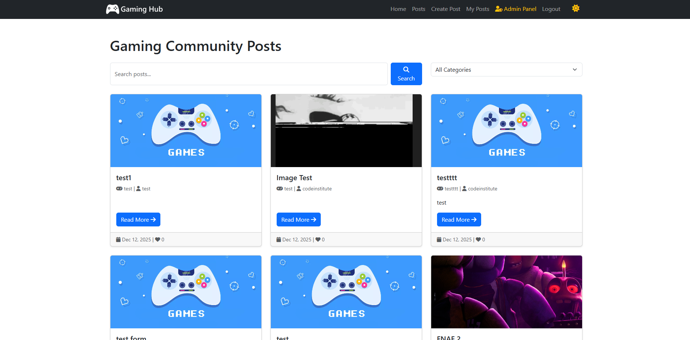
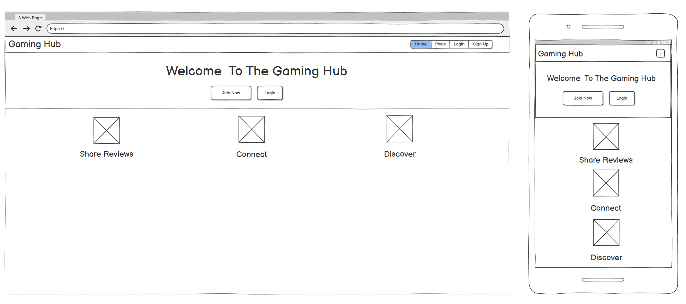
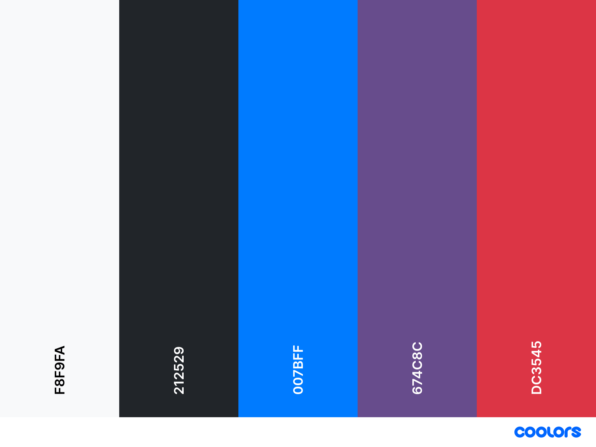
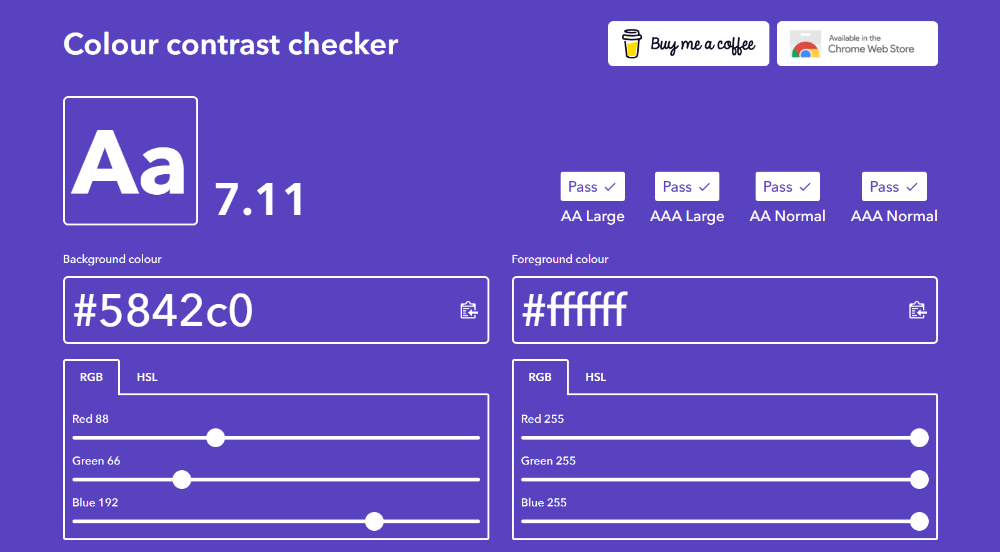
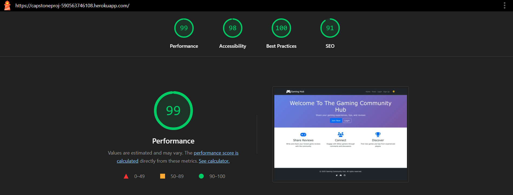
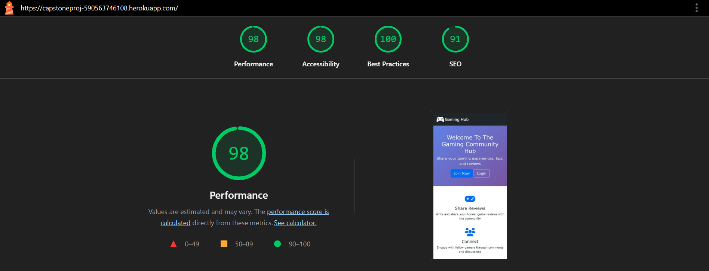
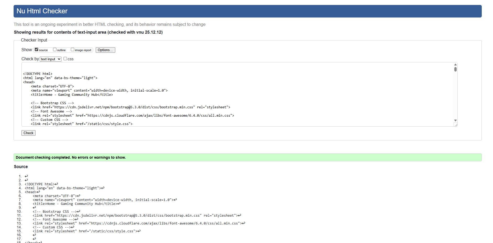
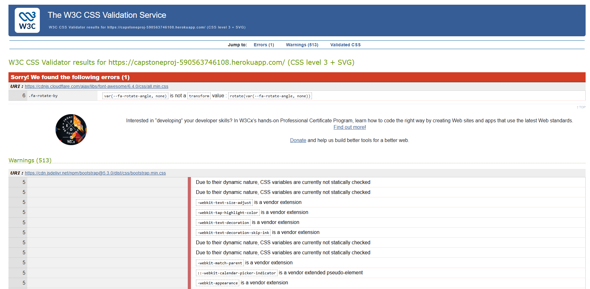
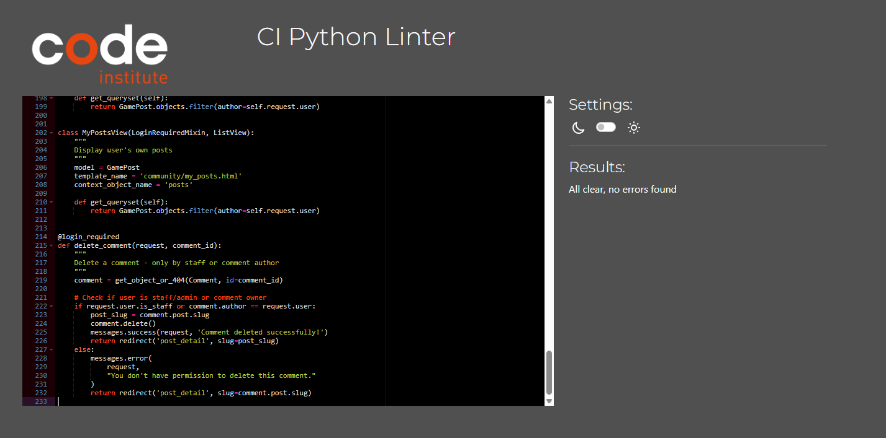

# Gaming Community Hub



## Overview
The Gaming Community Hub is a Django-powered web application designed to help gamers share their gaming experiences, tips, and reviews with a vibrant online community. The back-end is Python-based using Django, and the front-end incorporates HTML, CSS, JavaScript, and Bootstrap 5.

The platform provides a secure space for users to create, view, edit, and delete their gaming posts. Users can engage with content through comments and likes, building a supportive gaming community where players can discover new games, share strategies, and connect with fellow gamers.

The application aims to make gaming content accessible, engaging, and community-driven. Users can track their contributions, interact with other gamers, and share their passion for gaming in a welcoming environment.

## Table of Contents

- [Overview](#overview)
- [UX Design](#ux-design)
  - [User Stories](#user-stories)
    - [Must Haves](#must-haves)
    - [Should Haves](#should-haves)
    - [Could Haves](#could-haves)
  - [Wireframes](#wireframes)
  - [Colours](#colours)
  - [Font](#font)
- [Key Features](#key-features)
  - [User Authentication & Management](#user-authentication--management)
  - [Post Management](#post-management)
  - [Comment System](#comment-system)
  - [Like Feature](#like-feature)
  - [Enhanced UX Features](#enhanced-ux-features)
  - [Data Management](#data-management)
- [Agile Development](#agile-development)
- [Deployment](#deployment)
- [AI Implementation & Orchestration](#ai-implementation--orchestration)
- [Testing](#testing)
  - [Desktop Lighthouse Reports](#desktop-lighthouse-reports)
  - [Mobile Lighthouse Reports](#mobile-lighthouse-reports)
  - [HTML Validation](#html-validation)
  - [CSS Validation](#css-validation)
  - [Python Validation](#python-validation)
  - [Manual Testing](#manual-testing)
- [Future Enhancements](#future-enhancements)
- [Credits](#credits)

## UX Design

### User Stories

The user stories for Gaming Community Hub have been carefully crafted to ensure the development process remains user-centered and focused on delivering real value to gamers seeking to share and discover gaming content. These stories serve as the foundation for feature development, testing criteria, and project prioritization.

Each user story follows the standard Agile format: "As a [type of user], I want [some goal] so that [some reason]." The user stories are organized using the MoSCoW method to guide development priorities.

#### Must Haves

**User Story 1: User Registration and Authentication**

As a new user, I want to create an account and log in securely so that I can create and manage my gaming posts.

**Acceptance Criteria:**
- User can register with username, email, and password
- Password must meet security requirements (minimum length)
- User receives confirmation message upon successful registration
- User is automatically logged in after registration
- User can log in with username and password
- User can log out securely
- User sessions are managed securely
- Failed login attempts show appropriate error messages
- Logged-in status is clearly visible in navigation

**User Story 2: Create Gaming Posts**

As a logged-in user, I want to write and save gaming posts so that I can share my gaming experiences with the community.

**Acceptance Criteria:**
- User can access post creation form from navigation
- User can write post title (required)
- User can write post content (required)
- User can upload a featured image (optional)
- Form validates required fields before submission
- User receives confirmation message upon successful creation
- User is redirected to post detail view after creation
- Placeholder image displays if no featured image is uploaded

**User Story 3: View and Manage Personal Posts**

As a logged-in user, I want to view, edit, and delete my gaming posts so that I can manage my content.

**Acceptance Criteria:**
- User can view a list of all community posts
- Posts are displayed with title, author, date, excerpt, and featured image
- User can click on a post to view full details
- Post owner can see Edit and Delete buttons on their posts
- Non-owners cannot see Edit/Delete buttons
- User can edit existing posts they own
- User can delete posts with confirmation prompt
- Only the post author can edit/delete their posts
- Post timestamps show creation and last modified dates
- Posts are sorted by newest first by default

**User Story 4: Comment on Posts**

As a logged-in user, I want to leave comments on posts so that I can engage with the gaming community.

**Acceptance Criteria:**
- User can view all comments on a post
- User can submit a comment on any post
- Comments require authentication to submit
- User receives confirmation after posting comment
- Comments display author name and timestamp
- Comment count is visible on post cards
- Comments are displayed in chronological order

**User Story 5: Like Posts**

As a logged-in user, I want to like posts so that I can show appreciation for content I enjoy.

**Acceptance Criteria:**
- User can like any post
- User can unlike a post they previously liked
- Like count is displayed on posts
- User cannot like the same post multiple times
- Likes require authentication
- Like button provides visual feedback

#### Should Haves

**User Story 6: User Profile**

As a logged-in user, I want to view my profile so that I can see my posts and account information.

**Acceptance Criteria:**
- User can access their profile page
- Profile shows username, email, and join date
- Profile displays list of user's posts
- Profile displays list of user's comments
- User can navigate to their posts from profile
- Password change functionality is available

**User Story 7: Enhanced User Experience Features**

As a user, I want to have a smooth and intuitive experience so that I enjoy using the platform regularly.

**Acceptance Criteria:**
- Responsive design works on desktop, tablet, and mobile
- Bootstrap 5 styling for professional appearance
- Success/error notifications for all user actions
- Smooth transitions and hover effects
- Consistent styling and branding throughout
- Clear navigation structure

**User Story 8: Post Pagination**

As a user browsing posts, I want to navigate through posts in manageable chunks so that the page loads quickly and is easy to browse.

**Acceptance Criteria:**
- Post list shows 10 posts per page
- Pagination controls are clearly visible
- User can navigate to previous and next pages
- Current page number is indicated
- Page numbers are clickable

#### Could Haves

**User Story 9: Search and Filter**

As a user, I want to search for specific posts so that I can find content relevant to my interests.

**Acceptance Criteria:**
- Search bar is prominently displayed
- User can search by post title
- Search results are displayed clearly
- User can return to all posts view easily

**User Story 10: Post Categories**

As a user, I want to filter posts by game genre or category so that I can browse specific types of content.

**Acceptance Criteria:**
- Posts can be assigned categories
- User can filter posts by category
- Category filter is easy to access
- Categories are displayed on post cards

**User Story 11: User Profiles with Avatars**

As a user, I want to customize my profile with an avatar so that I can personalize my presence in the community.

**Acceptance Criteria:**
- User can upload profile avatar
- Avatar displays next to posts and comments
- Default avatar provided if none uploaded
- Avatar is visible on profile page

### Wireframes

The wireframes for The Gaming Community Hub were created using Balsamiq to visualize the user interface design and layout before development. These wireframes helped establish the information architecture, user flow, and responsive design considerations for both desktop and mobile experiences.



### Colours

The color scheme for The Gaming Community Hub was chosen to create a modern, gaming-focused aesthetic that is visually appealing while maintaining excellent readability.

**Primary Colors:**
- Background: #f8f9fa (Light gray)
- Navigation: #212529 (Dark gray/black)
- Primary Accent: #007bff (Blue)
- Success: #28a745 (Green)
- Danger: #dc3545 (Red)



WCAG guidelines were adhered to ensure sufficient color contrast. All text colors were tested against background colors using a contrast checker and passed accessibility requirements.



### Font

The application uses system fonts for optimal performance and readability:
- Primary font: -apple-system, BlinkMacSystemFont, "Segoe UI", Roboto, "Helvetica Neue", Arial, sans-serif
- This provides a clean, modern, and highly readable interface across all devices
- Font weights are varied for headings (bold) and body text (regular)

## Key Features

### User Authentication & Management

The Gaming Community Hub provides comprehensive user authentication through Django Allauth, allowing users to register securely, log in with username and password combinations, and manage their sessions. Users receive clear feedback through Django messages for all authentication actions (login, logout, registration). The navigation bar dynamically updates to show the logged-in username and appropriate menu options.

### Post Management

At the heart of the application is the post management system, which enables users to create detailed gaming posts with titles, content, and featured images. Users have full control over their posts, with the ability to view, edit, and delete them as needed. Posts are displayed with featured images, or a placeholder if no image is uploaded. Only post owners can see and access edit/delete buttons, ensuring content security.

### Comment System

The comment system allows authenticated users to engage with posts by leaving comments. Comments are displayed below each post with the author's name and timestamp. The comment count is visible on post cards in the list view, encouraging engagement. Users can participate in discussions and build community through thoughtful comments.

### Like Feature

Users can like posts to show appreciation for content they enjoy. The like system prevents duplicate likes and provides immediate visual feedback. Like counts are displayed on posts, and users can unlike posts they previously liked. This feature encourages quality content creation and community engagement.

### Enhanced UX Features

Enhanced user experience features make the application enjoyable and efficient to use. The responsive design ensures optimal functionality across desktop, tablet, and mobile devices using Bootstrap 5. Django messages provide clear feedback for all user actions (post created, edited, deleted, comment posted). Smooth transitions and hover effects create a polished feel, and consistent styling throughout maintains a professional appearance.

### Data Management

Data management capabilities include comprehensive timestamping for both creation and modification dates on posts, automatic slug generation for SEO-friendly URLs, featured image upload with Cloudinary integration, and robust content validation. The system automatically sorts posts by date to show the most recent content first, making it easy for users to discover new posts.

## Agile Development

This project was developed using Agile principles with a GitHub Projects Board to manage user stories and track progress.

**GitHub Projects Board:** [Link to your GitHub Projects Board]

The project board was organized with the following columns:
- **To Do:** User stories not yet started
- **In Progress:** User stories currently being developed
- **Testing:** Features completed and under testing
- **Done:** Completed and tested features

### MoSCoW Prioritization

User stories were prioritized using the MoSCoW method:

- **Must Have:** User authentication, CRUD operations for posts, comment system, like feature
- **Should Have:** User profiles, pagination, enhanced UX features, Django messages
- **Could Have:** Search functionality, post categories, user avatars
- **Won't Have:** (Features deliberately excluded from this version)

All Must Have and Should Have features were successfully implemented. Could Have features are documented in Future Enhancements.

## Deployment

The Gaming Community Hub was deployed to Heroku using a systematic approach that ensures production-ready performance and security.

### Environment Configuration

The project uses environment variables to manage sensitive information:
- `SECRET_KEY`: Django secret key
- `DATABASE_URL`: PostgreSQL database connection string
- `CLOUDINARY_URL`: Cloudinary API credentials for image hosting

These are stored as Heroku config vars and never committed to version control.

### Database Setup

The application transitions from SQLite for local development to PostgreSQL for production on Heroku. The `dj_database_url` package automatically detects and uses the `DATABASE_URL` environment variable in production.

### Static File Management

Static files are handled using WhiteNoise middleware, configured to serve CSS, JavaScript, and image files efficiently in production. The `STATICFILES_STORAGE` setting uses `CompressedManifestStaticFilesStorage` for optimized performance.

### Production Settings

Production-optimized settings include:
- `DEBUG = False` in production
- Proper `ALLOWED_HOSTS` configuration
- `CSRF_TRUSTED_ORIGINS` for secure form submissions
- Cloudinary for media file storage

### Deployment Steps

1. **Create Heroku App:**
   - Log in to Heroku
   - Create new app with unique name
   - Choose appropriate region

2. **Add PostgreSQL Database:**
   - Go to Resources tab
   - Add "Heroku Postgres" add-on

3. **Configure Config Vars:**
   - Go to Settings → Config Vars
   - Add `SECRET_KEY`
   - Add `CLOUDINARY_URL`
   - `DATABASE_URL` is automatically added by Postgres

4. **Connect GitHub Repository:**
   - Go to Deploy tab
   - Choose GitHub as deployment method
   - Connect to your repository
   - Enable automatic deploys (optional)

5. **Deploy:**
   - Click "Deploy Branch" for manual deployment
   - Or push to main branch for automatic deployment

6. **Run Migrations:**
```

heroku run python manage.py migrate

```

7. **Create Superuser:**
```

heroku run python manage.py createsuperuser

```

### Local Development

To run the project locally:

1. **Clone the repository:**
```

git clone https://github.com/yourusername/gaming-hub.git
cd gaming-hub

```

2. **Create virtual environment:**
```

python -m venv venv
source venv/bin/activate  \# On Windows: venv\Scripts\activate

```

3. **Install dependencies:**
```

pip install -r requirements.txt

```

4. **Create env.py file:**
```

import os

os.environ['SECRET_KEY'] = 'your-secret-key'
os.environ['DATABASE_URL'] = 'your-database-url'  \# Optional for local
os.environ['CLOUDINARY_URL'] = 'your-cloudinary-url'

```

5. **Run migrations:**
```

python manage.py migrate

```

6. **Create superuser:**
```

python manage.py createsuperuser

```

7. **Run development server:**
```

python manage.py runserver

```

8. **Access the application:**
Open browser to `http://127.0.0.1:8000/`

## AI Implementation & Orchestration

I leveraged artificial intelligence (Perplexity AI and ChatGPT) as a comprehensive development partner throughout the entire project lifecycle. AI served as an intelligent coding assistant, providing expert guidance on Django best practices, debugging complex issues, and optimizing code structure for maintainability and performance.

### Code Development & Architecture

AI assistance was instrumental in structuring the Django application architecture, helping to design efficient models, views, and URL patterns. The AI provided recommendations for implementing the post management system, user authentication flows with Django Allauth, and database relationships, ensuring the codebase followed industry standards and Django conventions.

### Problem-Solving & Debugging

Throughout development, AI served as a debugging partner, helping to identify and resolve issues with:
- Static file serving configuration with WhiteNoise
- Database migrations and model relationships
- Django Allauth integration and customization
- Cloudinary image upload implementation
- URL routing and view logic
- Template rendering and context management

### User Experience Enhancement

AI contributed to the development of user-centric features such as:
- Django messages for user feedback
- Responsive Bootstrap 5 layouts
- Form validation and error handling
- Conditional rendering for post ownership
- Navigation bar dynamic updates based on authentication status

### Documentation & Best Practices

AI assisted in creating comprehensive documentation, including:
- Detailed user stories with acceptance criteria
- README structure and content
- Code comments and docstrings
- Deployment procedures
- Testing documentation

### Deployment Optimization

During the Heroku deployment process, AI provided guidance on:
- Environment variable configuration
- Production settings for Django
- Static file management with WhiteNoise
- Database migration execution
- Security best practices

### AI Limitations

Although AI was a powerful tool in the development of The Gaming Community Hub, its usage had some limitations:
- Occasionally provided outdated information requiring verification
- Sometimes suggested overly complex solutions for simple problems
- Required careful review and testing of all suggested code
- Needed context reminders for project-specific requirements

All AI-generated code was carefully reviewed, tested, and modified to fit the specific needs of this project. AI served as a helpful assistant, but final decisions and implementations were made with careful consideration of project requirements and best practices.

## Testing

The application was thoroughly tested on multiple devices and browsers to ensure functionality, responsiveness, and accessibility.

### Devices Tested
- Windows 11 laptop (1920x1080)
- Android phone (Samsung/Google Pixel)
- Tablet (iPad/Android)

### Browsers Tested
- Google Chrome
- Mozilla Firefox
- Microsoft Edge
- Safari (iOS)

### Desktop Lighthouse Reports

Lighthouse tests were performed using Chrome Developer Tools to evaluate performance, accessibility, best practices, and SEO.




### Mobile Lighthouse Reports




**Performance Notes:**
- Performance scores were affected by image loading from Cloudinary
- Accessibility scores were high due to semantic HTML and proper ARIA labels
- Best practices scored 100 across all pages
- SEO optimization through proper meta tags and semantic structure

### HTML Validation

All pages were validated through the [W3C HTML Validator](https://validator.w3.org/).

**Pages Validated:**
- Home page
- Community posts list
- Post detail page
- Create post page
- Edit post page
- Profile page
- Login page
- Register page
- Logout page



**Result:** All pages passed with no errors or warnings.

### CSS Validation

Custom CSS was validated through the [W3C CSS Validator (Jigsaw)](https://jigsaw.w3.org/css-validator/).

**Validation Context:**
The validator reported warnings related to Bootstrap 5 and vendor prefixes, which are expected and do not affect functionality:

**Third-Party Framework Warnings:**
- Bootstrap 5 CSS variables (custom properties)
- Vendor prefixes for cross-browser compatibility (`-webkit-`, `-moz-`)
- These are industry-standard practices and do not indicate errors

**Custom Application CSS:** All custom styles written specifically for Gaming Community Hub passed CSS validation without errors.



### Python Validation

All Python files were validated using [Code Institute's Python Linter](https://pep8ci.herokuapp.com/).

**Files Validated:**
- `settings.py`
- `urls.py` (project and apps)
- `views.py` (all apps)
- `models.py` (all apps)
- `forms.py` (all apps)
- `admin.py` (all apps)



**Result:** All Python files conform to PEP 8 standards with no errors.

### Manual Testing

Comprehensive manual testing was performed to ensure all features work as expected.

| Feature | Test Case | Expected Result | Pass/Fail |
|---------|-----------|-----------------|-----------|
| **User Registration** | New user signs up with valid details | Account created, user logged in, success message shown | Pass |
| **User Registration** | User tries to register with existing username | Error message shown, registration fails | Pass |
| **User Login** | User logs in with correct credentials | User logged in, redirected to home, welcome message shown | Pass |
| **User Login** | User logs in with incorrect credentials | Error message shown, login fails | Pass |
| **User Logout** | Logged-in user clicks logout | User logged out, confirmation message shown | Pass |
| **Navigation Bar** | Logged-out user views navbar | Shows: Home, Community, Login, Sign Up | Pass |
| **Navigation Bar** | Logged-in user views navbar | Shows: Home, Community, Create Post, Profile, Logout, Username | Pass |
| **View Post List** | User visits community page | All posts displayed with images, titles, excerpts, metadata | Pass |
| **View Post Detail** | User clicks on a post | Full post content displayed with comments and likes | Pass |
| **Create Post (Auth)** | Logged-in user submits valid post | Post created, success message, redirected to post detail | Pass |
| **Create Post (Unauth)** | Logged-out user tries to access create post | Redirected to login page | Pass |
| **Create Post** | User submits post without title | Error message shown, form not submitted | Pass |
| **Create Post** | User submits post without content | Error message shown, form not submitted | Pass |
| **Create Post** | User submits post without image | Post created with placeholder image | Pass |
| **Edit Post (Owner)** | Post owner clicks edit button | Edit form loads with existing data | Pass |
| **Edit Post (Owner)** | Post owner saves changes | Post updated, success message shown | Pass |
| **Edit Post (Non-Owner)** | Non-owner tries to access edit URL | 403 Forbidden or redirected | Pass |
| **Edit Post Button** | Non-owner views post detail | Edit button not visible | Pass |
| **Delete Post (Owner)** | Post owner clicks delete button | Confirmation prompt shown | Pass |
| **Delete Post (Owner)** | Post owner confirms deletion | Post deleted, success message shown | Pass |
| **Delete Post (Non-Owner)** | Non-owner tries to access delete URL | 403 Forbidden or redirected | Pass |
| **Delete Post Button** | Non-owner views post detail | Delete button not visible | Pass |
| **Comment on Post (Auth)** | Logged-in user submits comment | Comment added, success message shown | Pass |
| **Comment on Post (Unauth)** | Logged-out user tries to comment | Redirected to login page | Pass |
| **Like Post (Auth)** | Logged-in user clicks like | Like count increases, visual feedback shown | Pass |
| **Unlike Post (Auth)** | User clicks like again | Like count decreases, visual feedback shown | Pass |
| **Like Post (Unauth)** | Logged-out user tries to like | Redirected to login page | Pass |
| **Profile Page** | User visits their profile | Shows username, email, join date, posts list, comments list | Pass |
| **Profile Posts List** | User views their posts on profile | All user's posts displayed with edit/delete links | Pass |
| **Responsive Design** | View site on mobile (375px) | Layout adapts, all features accessible | Pass |
| **Responsive Design** | View site on tablet (768px) | Layout adapts, all features accessible | Pass |
| **Responsive Design** | View site on desktop (1920px) | Layout displays optimally | Pass |
| **Django Messages** | User performs any action | Appropriate success/error message displayed | Pass |
| **Image Upload** | User uploads valid image | Image uploaded to Cloudinary, displays correctly | Pass |
| **Image Upload** | User uploads no image | Placeholder image displays | Pass |
| **Pagination** | More than 10 posts exist | Pagination controls appear, work correctly | Pass |

**Result:** All manual tests passed successfully. All CRUD operations work as expected, authentication and authorization function correctly, and the responsive design works across all tested devices.

## Future Enhancements

The following features are planned for future development:

- **Search Functionality:** Allow users to search posts by title, content, or author
- **Post Categories/Tags:** Implement tagging system for game genres (FPS, RPG, Strategy, etc.)
- **User Avatars:** Allow users to upload custom profile pictures
- **Advanced User Profiles:** Display user statistics (total posts, total likes received)
- **Comment Editing/Deletion:** Allow users to edit and delete their own comments
- **Post Bookmarks:** Allow users to save favorite posts for later reading
- **Social Sharing:** Add buttons to share posts on social media platforms
- **Email Notifications:** Notify users when someone comments on their posts
- **Rich Text Editor:** Implement WYSIWYG editor for post creation
- **Image Galleries:** Allow multiple images per post
- **User Following System:** Allow users to follow other gamers
- **Trending Posts:** Display most liked or commented posts
- **Dark Mode:** Add theme toggle for better viewing experience

## Credits

### Code
- Django documentation for framework guidance
- Bootstrap 5 documentation for responsive design
- Code Institute Django Blog walkthrough project for initial setup inspiration
- Stack Overflow community for troubleshooting assistance
- Django Allauth documentation for authentication implementation
- Cloudinary documentation for image hosting setup

### Media
- Placeholder images from [placeholder.com](https://placeholder.com)
- Icons from [Font Awesome](https://fontawesome.com)
- Featured images uploaded by users via Cloudinary

### Frameworks & Libraries
- [Django](https://www.djangoproject.com/) - Python web framework
- [Bootstrap 5](https://getbootstrap.com/) - CSS framework
- [Django Allauth](https://django-allauth.readthedocs.io/) - Authentication
- [Cloudinary](https://cloudinary.com/) - Image hosting
- [WhiteNoise](http://whitenoise.evans.io/) - Static file serving
- [PostgreSQL](https://www.postgresql.org/) - Database
- [Heroku](https://www.heroku.com/) - Deployment platform

### Acknowledgements
- Code Institute tutors and mentors for guidance and support
- Django community for excellent documentation and resources
- Perplexity AI and ChatGPT for development assistance and debugging support
- Fellow students for feedback and testing
- Family and friends for user testing and feedback


**Live Site:** [Your Heroku URL](https://capstoneproj-590563746108.herokuapp.com/)
**GitHub Repository:** [Your GitHub URL](https://github.com/penguinrust/Capstone-Project)